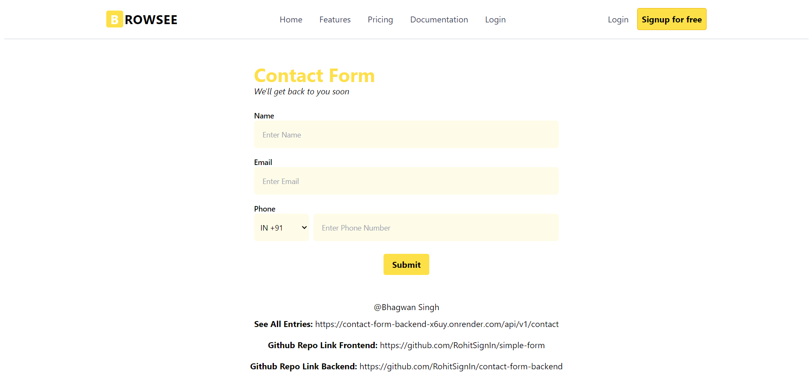
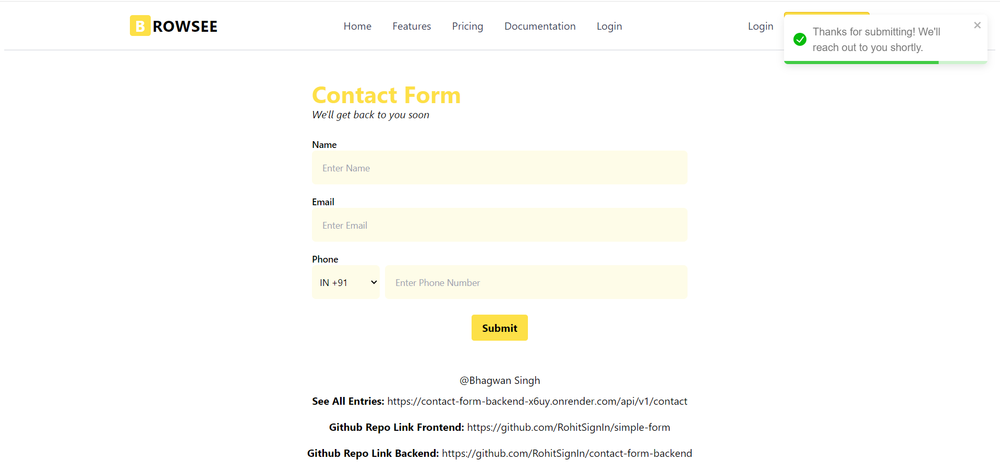
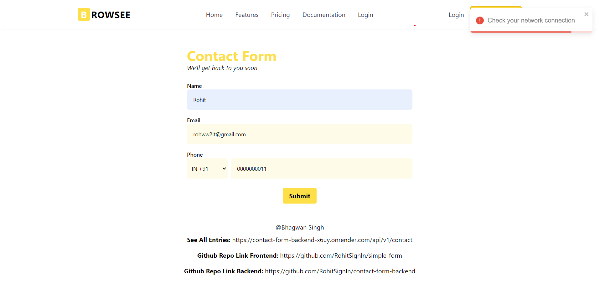

# Simple React Form

This is a simple React form created for an assignment, utilizing modern web development technologies including React, TypeScript, Tailwind CSS, React Toastify, React Hook Form, Vite, and Axios.

## Features

- **Form Fields:**

  - First Name
  - Email
  - Country Dial Code and Phone Number

- **Submit Button:**

  - Submits the form data to the backend.

- **Response Handling:**
  - Displays success or failure messages using React Toastify.

## Technologies Used

- **React**: JavaScript library for building user interfaces.
- **TypeScript**: Adds static typing to JavaScript to enhance developer productivity and code quality.
- **Tailwind CSS**: Utility-first CSS framework for quickly building custom designs.
- **React Toastify**: Lightweight notification library for displaying toasts.
- **React Hook Form**: Library for managing form state and validation in React.
- **Vite**: Frontend build tool that provides fast development server and optimized production build.
- **Axios**: Promise-based HTTP client for making HTTP requests.

## Setup

1. Clone the repository.
2. Install dependencies using `npm install` or `yarn install`.
3. Start the development server using `npm run dev` or `yarn dev`.
4. Open your browser and navigate to `http://localhost:3000`.

## Environment Variables

Create a `.env` file in the root directory of your project and Check the .sampleenv in Repo. you have to add backend link in a "VITE_API_BASE_URL" variable.

### check here for backend repo, https://github.com/RohitSignIn/contact-form-backend

## Usage

1. Fill in the form fields with appropriate data.
2. Click the submit button to submit the form.
3. Check the toast notifications for success or failure messages.

## Screenshots

